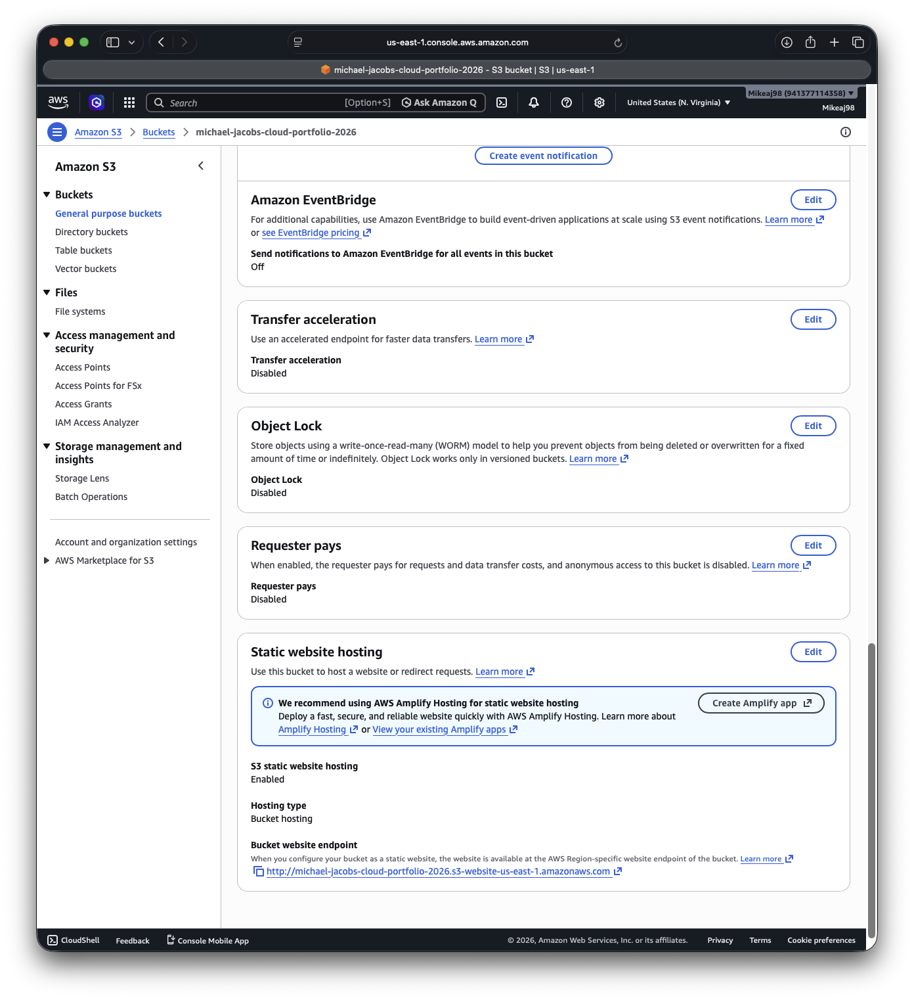
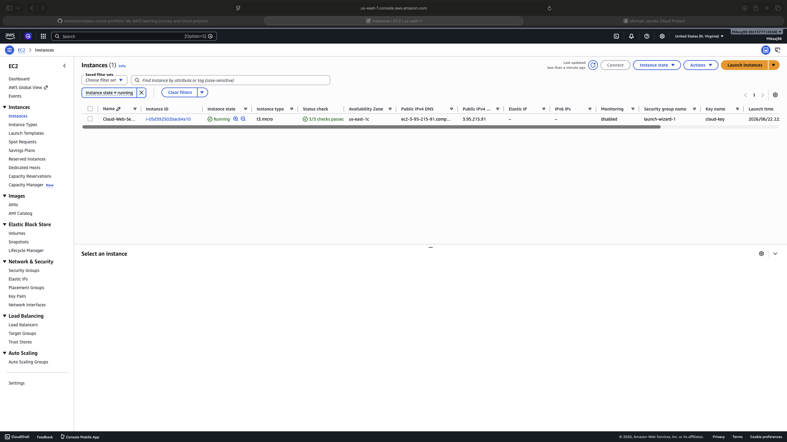
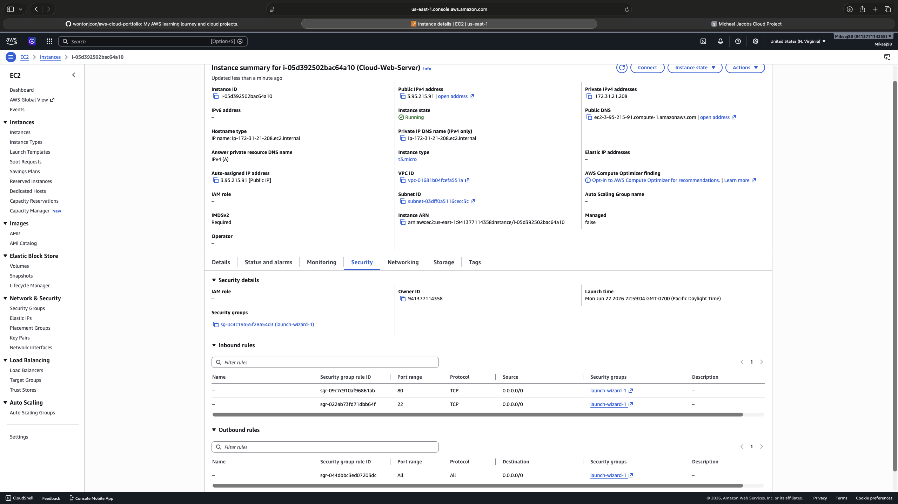
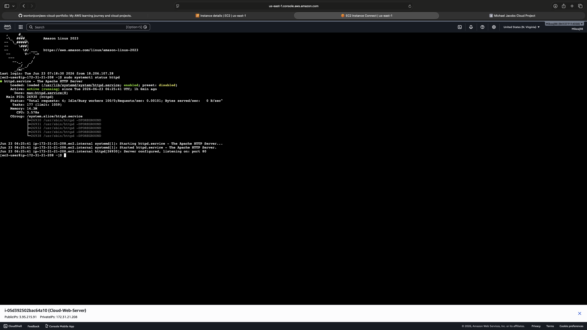
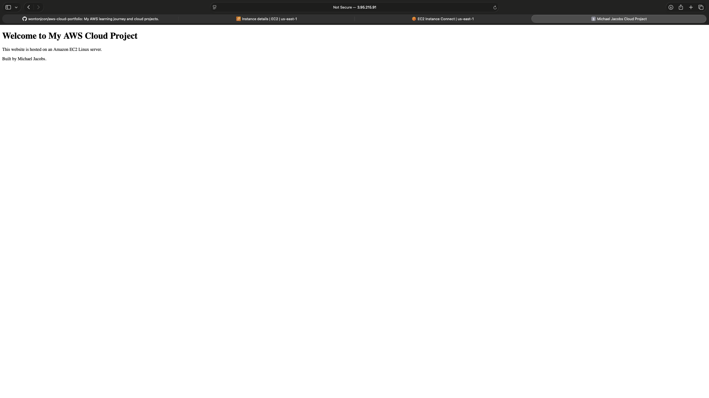

## About

This repository documents my AWS Cloud learning journey as I build hands-on projects using Amazon Web Services.

Current Projects:
- Project 1: Amazon S3 Static Website Hosting

# AWS Cloud Portfolio

## Project 1 - Amazon S3 Static Website Hosting

### Overview
Created and hosted a static website using Amazon S3.

### AWS Services Used
- Amazon S3
- Bucket Policies
- Static Website Hosting

### Skills Learned
- Creating S3 buckets
- Uploading objects
- Managing permissions
- Configuring bucket policies
- Hosting a website

### Outcome
Successfully deployed a website using Amazon S3 Static Website Hosting.

## Screenshots

### S3 Bucket Overview

### Static Website Hosting

### Live Website

### EC2 Dashboard

### Security Group Rules

### Apache Running

### Website Deployment

